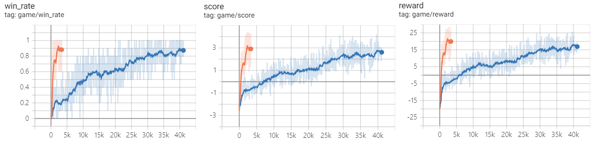
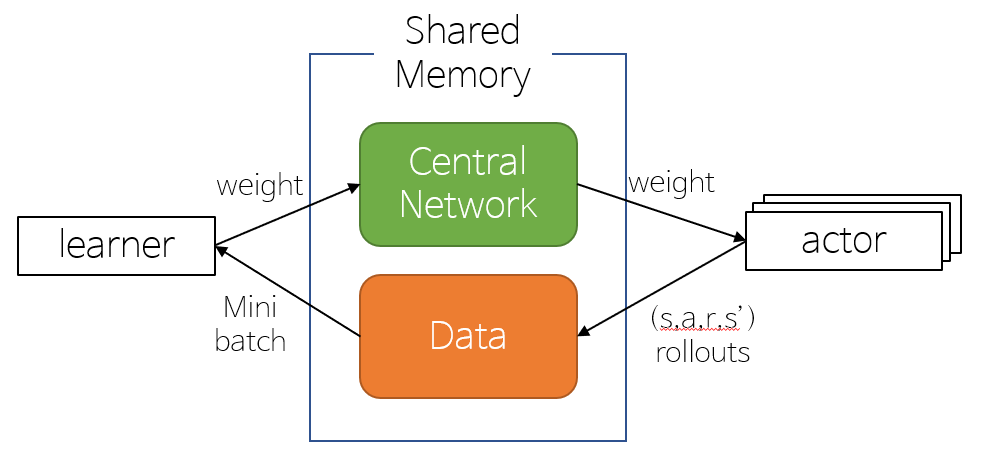

# Google Research Football Competition - liveinparis team

* The exact codes used by the team "liveinparis" at [the kaggle football competition](https://www.kaggle.com/c/google-football)

* Implementations of self-play RL from scratch with distributed actors 

* Final version of agents currently ranked 8th/1141 at the competition (Gold prize)

* Detailed discription of our [approach](https://www.kaggle.com/c/google-football/discussion/201376)


## Dependencies
1. [google-research football](https://github.com/google-research/football)
2. PyTorch
3. tensorboardX
4. kaggle_environments

## Usage
```bash
python3 train.py 
# You can find args and hyper-parameters at the "arg_dict" in train.py. 
```

## training curves (vs rule base AI)

(x-axis : # of episodes)
1. Orange curve - vs. easy level AI
2. Blue - vs. medium level AI 

## learning system
</img>


