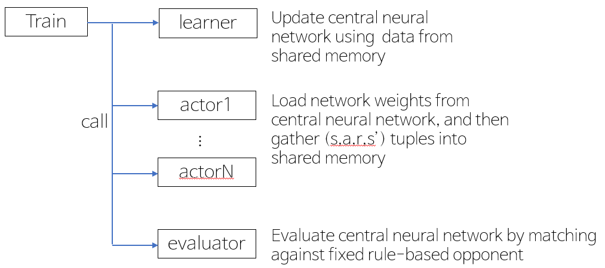

# football-paris
Implementations of self-play RL algorithms(PyTorch based)

* Our team "liveinparis" ranked th in competition.

* Exact codes used from the competition.


## Dependencies
1. [google-research football](https://github.com/google-research/football)
2. PyTorch
3. tensorboardX

## Usage
```bash
# Works only with Python 3.
# e.g.
python3 train.py
```

## learning system
</img>


## training curves


